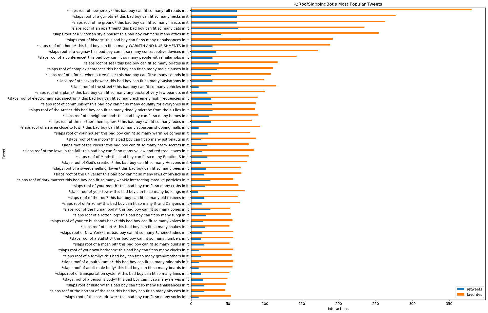

# User Tweet Visualizer

This is a toy script I created when I was curious about what the most popular
tweets of various Twitter users were. Run it as `python viz_tweets.py <handle>`
and it will generate a visualization of that user's most popular tweets and
save it to `<handle>/tweets.png`.
For example, `python viz_tweets.py RoofSlappingBot` will generate the following
visualization and save it to `RoofSlappingBot/tweets.png`:

